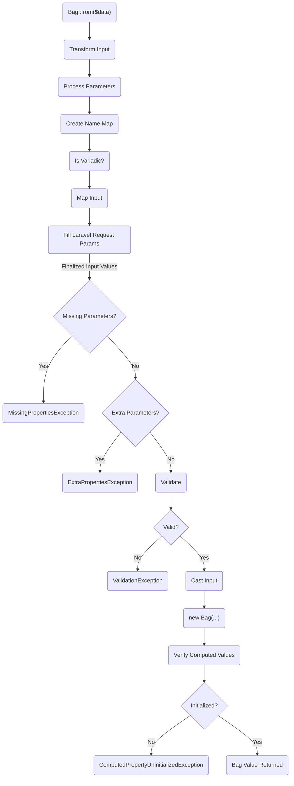
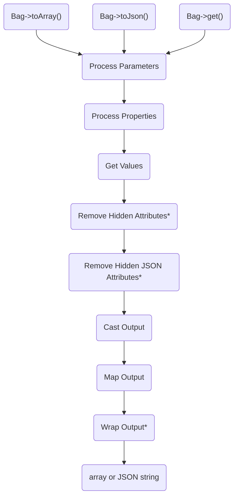

# How Bag Works

Bag works by utilizing a pipelines to process the input and output data. There is an `InputPipeline` and an `OutputPipeline`. 

## The Input Pipeline

The `InputPipeline` is responsible for processing the input data so that the `Bag` object can be created. The pipeline
consists of the following steps:

## The Output Pipeline

The `OutputPipeline` is responsible transforming the Bag data to the desired output array or JSON. The pipeline consists of the following steps:

> [!NOTE]
> \* These steps are only performed if the Bag is being converted to an array or JSON.
