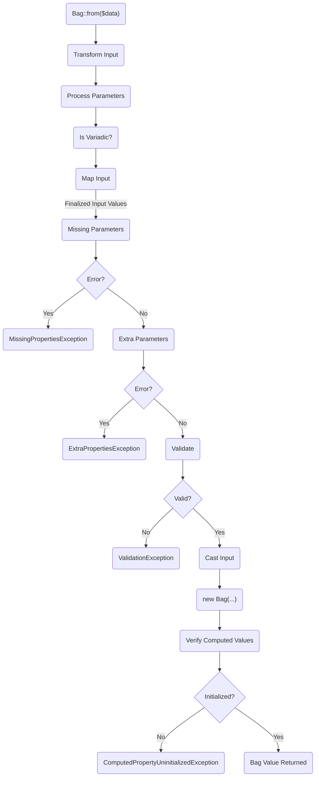
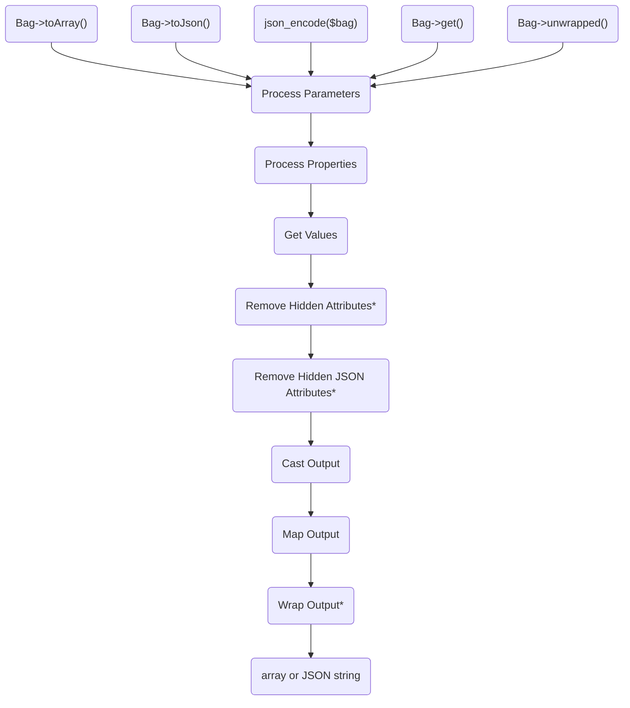
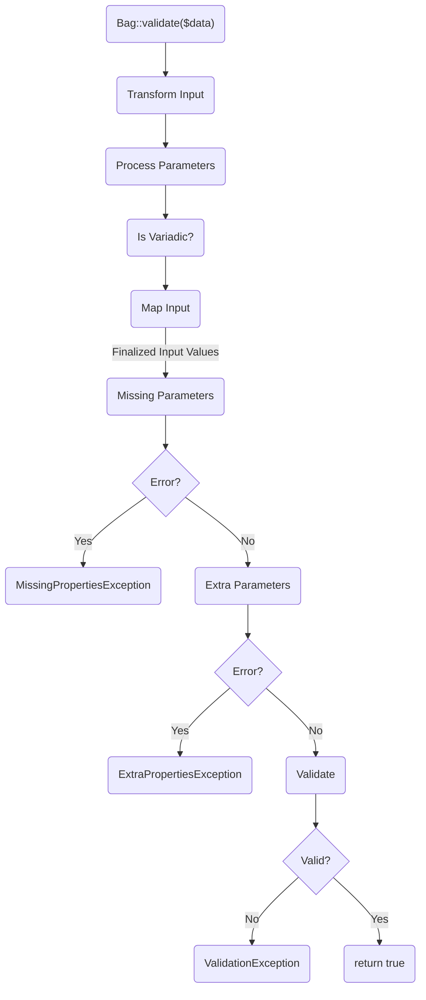
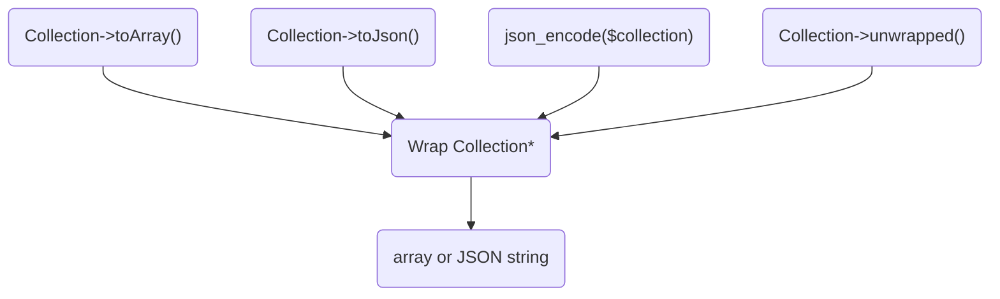

# How Bag Works

Bag works by utilizing pipelines to process the input and output data. 

There are four pipelines:

- `InputPipeline` for handling input and constructing the Bag object 
- `ValidationPipeline` for validating without constructing the Bag object
- `OutputPipeline` for handling output
- `OutputCollectionPipeline` for handling collection output

Each pipeline is detailed below.

> [!TIP]
> Each stage in the diagrams below is linked to the relevant source code for that stage.

## The Input Pipeline

The [`InputPipeline`](https://github.com/dshafik/bag/blob/main/src/Bag/Pipelines/InputPipeline.php) is responsible for processing the input data so that the `Bag` object can be created. The pipeline
consists of the following steps:

## The Output Pipeline

The `OutputPipeline` is responsible transforming the Bag data to the desired output array or JSON. The pipeline consists of the following steps:

> [!NOTE]
> \* These steps are only performed if the Bag is being converted to an array and/or JSON.

## The Validation Pipeline

The `ValidationPipeline` is responsible for validating the input data without constructing the Bag object. The pipeline consists of the following steps:

## The Output Collection Pipeline

The `OutputCollectionPipeline` is responsible for transforming the Bag collection data to the desired output array or JSON. The pipeline consists of the following steps:

> [!NOTE]
> \* This step is only performed if the Bag is being converted to an array and/or JSON.

